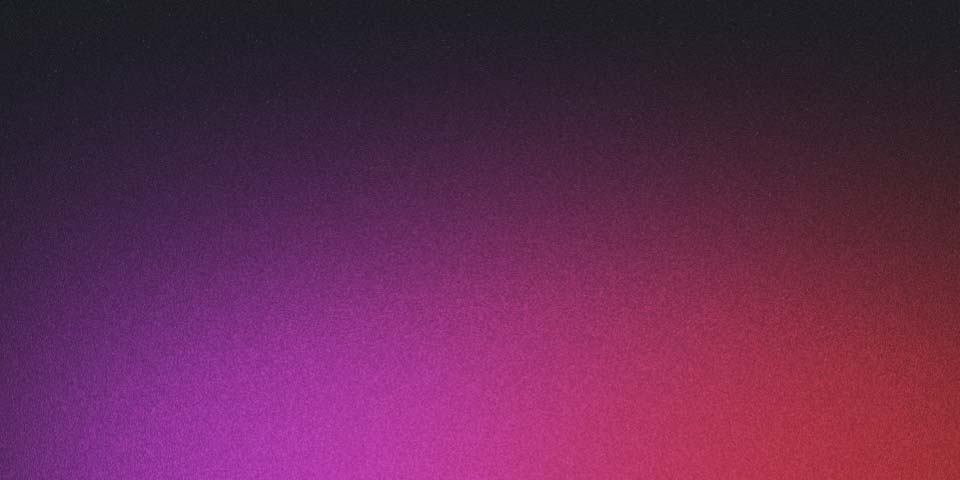

> 💡 **PR/Notice**: 本ページはアフィリエイトプログラムによる収益を得ています。

弐瓶勉作品の退廃的で硬質な世界観を愛する僕にとって、劇場アニメ「BLAME!」の映像化はまさに待望だった。特にこの初回限定版[Blu-ray](https://af.moshimo.com/af/c/click?a_id=5750806&p_id=170&pc_id=185&pl_id=27060&s_v=b5Rz2dtPAnup&url=https%3A%2F%2Fwww.amazon.co.jp%2Fs%3Fk%3D%25E3%2582%25A2%25E3%2583%258B%25E3%2583%25A1%2520Blu-ray)（KIXA-90769）は、単なる本編ディスクに留まらない。

高精細な映像と圧倒的な音響、そして豪華な封入特典が、あの無限に広がる巨大都市の深淵へと僕を再び誘い込む、ファン垂涎のコレクターズアイテムだ。

BLAME [Blu-ray](/blog/kill-la-kill-bd-box/) KIXA-90769 キングレコード](https://af.moshimo.com/af/c/click?a_id=5750806&p_id=170&pc_id=185&pl_id=27060&s_v=b5Rz2dtPAnup&url=https%3A%2F%2Fwww.amazon.co.jp%2Fs%3Fk%3DBLAME%2520%25E5%258A%2587%25E5%25A0%25B4%25E3%2582%25A2%25E3%2583%258B%25E3%2583%25A1%2520%25E5%2588%259D%25E5%259B%259E%25E5%259B%259B%25E5%25AE%259A%25E7%2589%2588%2520Blu-ray)

💡 この記事の結論＆3分まとめ

<ul class="summary-box-list" style="margin: 0; padding-left: 18px; font-size: 0.88rem; color: #1e3a8a; line-height: 1.65;">
<li style="margin-bottom: 6px;"><strong>商品の魅力</strong>: 原作の魅力を余すところなく立体化し、細部まで徹底的にこだわった造形美と再現度。</li>
<li style="margin-bottom: 6px;"><strong>おすすめな人</strong>: 好きなキャラクターへの愛を形にし、デスクや部屋に飾って鑑賞を楽しみたいファン。</li>
<li><strong>購入前の注意点</strong>: 飾るための設置スペース（高さ・奥行き）と、直射日光・ホコリを避ける展示環境をチェック。</li>
</ul>

📘 編集部イチオシ名作完結・全巻セット / リマスター

<h4 style="margin: 0 0 10px 0; font-size: 1.15rem; font-weight: 700; color: #1a202c; line-height: 1.4;">BLAME Blu-ray KIXA-90769 キングレコード</h4>

弐瓶勉原作の劇場アニメ「BLAME!」の初回限定版Blu-ray。本編ディスクに加え、オリジナルサウンドトラックCD、32Pのビジュアルブック、縮刷版劇場パンフレット、描き下ろし漫画を含む豪華特典を封入。廃墟となった世界を彷徨う探索者・霧亥

🟢 在庫あり（即納対応）
最安値をチェック

※表示価格・在庫は調査時点のものです。最新情報は各ストアでご確認ください。

<a href="https://af.moshimo.com/af/c/click?a_id=5787716&p_id=170&pc_id=185&pl_id=27060&s_v=b5Rz2dtPAnup&url=https%3A%2F%2Fwww.amazon.co.jp%2Fs%3Fk%3DBLAME%2520Blu-ray%2520KIXA-90769%2520%25E3%2582%25AD%25E3%2583%25B3%25E3%2582%25B0%25E3%2583%25AC%25E3%2582%25B3%25E3%2583%25BC%25E3%2583%2589" target="_blank" rel="nofollow noopener noreferrer" style="padding: 10px 8px; border-radius: 8px; font-weight: 700; font-size: 0.84rem; text-align: center; text-decoration: none !important; display: flex; align-items: center; justify-content: center; min-height: 42px; box-shadow: 0 2px 4px rgba(0,0,0,0.06); transition: transform 0.15s, box-shadow 0.15s; background: linear-gradient(135deg, #ff9900, #e68a00); color: #ffffff !important; font-size: 0.95rem; min-height: 46px; box-shadow: 0 3px 8px rgba(255,153,0,0.25);">🛒 Amazonで最安値をチェック（Kindle即時配信・紙版）</a>

<a href="https://hb.afl.rakuten.co.jp/hgc/06bf284d.0ec76ac0.06bf284e.9bf246b7/?pc=https%3A%2F%2Fsearch.rakuten.co.jp%2Fsearch%2Fmall%2FBLAME%20Blu-ray%20KIXA-90769%20%E3%82%AD%E3%83%B3%E3%82%B0%E3%83%AC%E3%82%B3%E3%83%BC%E3%83%89%2F" target="_blank" rel="nofollow noopener noreferrer" style="padding: 10px 8px; border-radius: 8px; font-weight: 700; font-size: 0.84rem; text-align: center; text-decoration: none !important; display: flex; align-items: center; justify-content: center; min-height: 42px; box-shadow: 0 2px 4px rgba(0,0,0,0.06); transition: transform 0.15s, box-shadow 0.15s; background: linear-gradient(135deg, #bf0000, #9e0000); color: #ffffff !important;">🔴 楽天市場（楽天ポイント還元）</a>
<a href="https://af.moshimo.com/af/c/click?a_id=5787716&p_id=1225&pc_id=1925&pl_id=27061&s_v=b5Rz2dtPAnup&url=https%3A%2F%2Fshopping.yahoo.co.jp%2Fsearch%3Fp%3DBLAME%2520Blu-ray%2520KIXA-90769%2520%25E3%2582%25AD%25E3%2583%25B3%25E3%2582%25B0%25E3%2583%25AC%25E3%2582%25B3%25E3%2583%25BC%25E3%2583%2589" target="_blank" rel="nofollow noopener noreferrer" style="padding: 10px 8px; border-radius: 8px; font-weight: 700; font-size: 0.84rem; text-align: center; text-decoration: none !important; display: flex; align-items: center; justify-content: center; min-height: 42px; box-shadow: 0 2px 4px rgba(0,0,0,0.06); transition: transform 0.15s, box-shadow 0.15s; background: linear-gradient(135deg, #ff0033, #cc0029); color: #ffffff !important;">🟣 Yahoo!（PayPayポイント）</a>
<a href="https://al.dmm.com/?lurl=https%3A%2F%2Fbook.dmm.com%2Fsearch%2F%3Fsearchstr%3DBLAME%20Blu-ray%20KIXA-90769%20%E3%82%AD%E3%83%B3%E3%82%B0%E3%83%AC%E3%82%B3%E3%83%BC%E3%83%89&af_id=DMMaria-999" target="_blank" rel="nofollow noopener noreferrer" style="padding: 10px 8px; border-radius: 8px; font-weight: 700; font-size: 0.84rem; text-align: center; text-decoration: none !important; display: flex; align-items: center; justify-content: center; min-height: 42px; box-shadow: 0 2px 4px rgba(0,0,0,0.06); transition: transform 0.15s, box-shadow 0.15s; background: linear-gradient(135deg, #1877f2, #0d5cb6); color: #ffffff !important;">📘 DMM（無料試し読み）</a>
<a href="https://px.a8.net/svt/ejp?a8mat=4B8BWQ+57JKC2+1892+6QEUP" target="_blank" rel="nofollow noopener noreferrer" style="padding: 10px 8px; border-radius: 8px; font-weight: 700; font-size: 0.84rem; text-align: center; text-decoration: none !important; display: flex; align-items: center; justify-content: center; min-height: 42px; box-shadow: 0 2px 4px rgba(0,0,0,0.06); transition: transform 0.15s, box-shadow 0.15s; background: linear-gradient(135deg, #059669, #047857); color: #ffffff !important;">📚 全巻セット（漫画全巻ドットコム）</a>

※各ECサイトの最新価格や在庫状況は各リンク先でご確認ください。

## スクリーンに映し出された巨大都市の音と光

劇場版「BLAME!」の映像と音響は、弐瓶勉の世界観を再現するための緻密な設計思想が凝縮されている。本作のセルルック3DCGは、原作の持つ無機質な巨大構造物や機械的なキャラクターデザインと非常に相性が良い。

手描きアニメでは難しい、無限に広がる都市の途方もないスケール感を破綻なく描くことに成功している。

特に印象的なのは、光と影のコントラストだ。廃墟と化した都市の奥深く、わずかな光源が巨大な建造物の輪郭を浮かび上がらせる。この光の表現が、広大な空間の奥行きや、そこに漂う絶望感を強調する。僕が初めて観た時、その圧倒的なスケール感に思わず息を飲んだ。

音響面では、静寂と轟音の使い分けが巧みだ。探索者・霧亥が広大な通路を一人歩くシーンでは、わずかな足音や環境音だけが響き、都市の孤独と広がりを感じさせる。

対して、セーフガードや珪素生物との戦闘シーンでは、金属がぶつかり合う甲高い音、重力子放射線射出装置の鈍い発射音、そして着弾の激しい爆発音が、視聴者をスクリーンの中に引きずり込むような迫力を持つ。重厚な効果音を最大限に楽しむために、僕はヘッドホンで視聴するように工夫した。

これこそが、あの荒廃した世界を五感で追体験する鍵だと思う。

## 原作の哲学が息づく霧亥の孤独な旅

原作「BLAME!」は、言葉を極限まで削ぎ落とし、その代わりに圧倒的な画力で物語を紡ぐ。劇場版もまた、その哲学をしっかりと受け継いでいる。

主人公・霧亥（キリイ）がネット端末遺伝子を求め、際限なく広がる「都市」を彷徨う姿は、人間が機械文明の中で自己を見失い、それでもなお存在意義を問う普遍的なテーマを象徴している。

劇場版では、電基漁師たちの集落を舞台に、彼らの生活や苦悩が描かれる。これにより、原作では描かれなかった「都市」に暮らす人々の息遣いが加わり、霧亥の孤独な旅に新たな視点を与える。

シボとの出会い、そして彼女との奇妙な共闘は、無機質な世界における人間的な繋がりの脆さと尊さを浮き彫りにする。東亜重工の構造物や技術の描写は、単なるSFガジェットに留まらない。

それは、人間が創造したものが最終的に人間を圧倒し、取り込んでいく過程を示すメタファーとして機能するのだ。

RECOMMENDED SPECIAL OFFER

<h3 style="margin: 0 0 6px 0; font-size: 1.1rem; font-weight: 800; color: #1e40af; line-height: 1.4;">📺 アニメ化作品も30日間無料で見放題！</h3>

【DMM TV / 公式30日間無料体験】

話題の新作アニメから懐かしの名作まで5,000本以上が見放題！さらに今なら登録ですぐに使えるDMMポイント500ptプレゼント中。

<a href="https://al.dmm.com/?lurl=https%3A%2F%2Ftv.dmm.com%2Fvod%2F&af_id=DMMaria-999" target="_blank" rel="nofollow noopener noreferrer" style="display: inline-block; width: 100%; max-width: 380px; padding: 12px 20px; background: linear-gradient(135deg, #2563eb, #1d4ed8); color: #ffffff !important; font-weight: bold; font-size: 0.95rem; text-decoration: none !important; border-radius: 8px; box-shadow: 0 4px 10px rgba(0,0,0,0.15);">
👉 DMM TVで30日間無料体験してみる
</a>

## 価格と視聴環境に求める割り切り

この初回限定版Blu-ray（KIXA-90769）は、確かに素晴らしいコレクターズアイテムだが、その価格は8,800円と、決して気軽に手を出せる金額ではない。豪華特典が付いているとはいえ、一本の映画作品としては高価な部類に入る。

作品の世界観を存分に味わうには、それなりの視聴環境も求められる。

特に音響については、テレビの標準スピーカーだけでは重厚な効果音が物足りなく感じるかもしれない。良質なヘッドホンや、可能であればサラウンドシステムを用意することで、作品への没入感は格段に高まる。

初期の段階で「音の迫力が足りない」と感じた僕も、ヘッドホンを使うことで印象がガラリと変わった。

また、初回限定版という性質上、時間が経つと入手困難になる可能性がある。手に入れたいなら早めの決断が必要だろう。

| 項目 | 詳細 |
| :--- | :--- |
| 価格 | 8,800円 |
| メーカー | キングレコード |
| 型番/仕様 | KIXA-90769 / Blu-rayディスク1枚 + CD1枚 / 封入特典多数 |
| 主な特徴 | 弐瓶勉による描き下ろし漫画、ビジュアルブック、OSTなど豪華特典が付属。高精細な映像で終末世界を体験できる。 |

## コレクションとしての存在感と作品への愛着

BLAME!劇場版初回限定版Blu-rayのパッケージは、そのデザインからして弐瓶勉の世界観を忠実に再現している。無機質で硬質な、それでいてどこか退廃的な美しさが所有欲を刺激する。

本編ディスクとオリジナルサウンドトラックCD、そして32Pのビジュアルブック、縮刷版劇場パンフレット、さらに描き下ろし漫画までが統一されたアートワークでまとめられている。

これらを手に取ると、単なる映像ソフトというよりも、一つの美術作品や資料集に近い感覚を覚える。書棚に並べたときの存在感は抜群で、SF作品好きの友人には必ず目を留められる。

僕は購入後、まずビジュアルブックと描き下ろし漫画を熟読し、作品世界への理解を深めてから本編を視聴した。この多層的なアプローチが、作品への愛着をより一層強めてくれた。

物理的な特典が、デジタルの映像だけでは得られない「所有する喜び」を与えてくれるのだ。

## 終末SFファンが手に入れるべき体験の集積

劇場版「BLAME!」の初回限定版Blu-rayは、弐瓶勉作品のファンにとって、単なる映像ソフトの枠を超えた「体験の集積」と言える。高精細な映像と迫力の音響で終末世界を体感し、特典のオリジナルサウンドトラックCDでその余韻に浸る。

さらに、32ページのビジュアルブックや描き下ろし漫画で、作品の背景や深層に触れることができる。

これは、作品の世界観をあらゆる角度から堪能し、自分のコレクションとして大切にしたいと願う人に向けて作られたパッケージだ。弐瓶勉作品特有の無機質で圧倒的なスケール、そして哲学的な問いかけに魅力を感じるなら、このBlu-rayはあなたのSFコレクションの中心を飾る一品になるだろう。

[BLAME Blu-ray KIXA-90769 キングレコード](https://af.moshimo.com/af/c/click?a_id=5750806&p_id=170&pc_id=185&pl_id=27060&s_v=b5Rz2dtPAnup&url=https%3A%2F%2Fwww.amazon.co.jp%2Fs%3Fk%3DBLAME%2520%25E5%258A%2587%25E5%25A0%25B4%25E3%2582%25A2%25E3%2583%258B%25E3%2583%25A1%2520%25E5%2588%259D%25E5%259B%259B%25E5%25AE%259A%25E7%2589%2588%2520Blu-ray)

💡 この記事の結論＆3分まとめ

<ul class="summary-box-list" style="margin: 0; padding-left: 18px; font-size: 0.88rem; color: #1e3a8a; line-height: 1.65;">
<li style="margin-bottom: 6px;"><strong>商品の魅力</strong>: 原作の魅力を余すところなく立体化し、細部まで徹底的にこだわった造形美と再現度。</li>
<li style="margin-bottom: 6px;"><strong>おすすめな人</strong>: 好きなキャラクターへの愛を形にし、デスクや部屋に飾って鑑賞を楽しみたいファン。</li>
<li><strong>購入前の注意点</strong>: 飾るための設置スペース（高さ・奥行き）と、直射日光・ホコリを避ける展示環境をチェック。</li>
</ul>

📘 編集部イチオシ名作完結・全巻セット / リマスター

<h4 style="margin: 0 0 10px 0; font-size: 1.15rem; font-weight: 700; color: #1a202c; line-height: 1.4;">BLAME Blu-ray KIXA-90769 キングレコード</h4>

弐瓶勉原作の劇場アニメ「BLAME!」の初回限定版Blu-ray。本編ディスクに加え、オリジナルサウンドトラックCD、32Pのビジュアルブック、縮刷版劇場パンフレット、描き下ろし漫画を含む豪華特典を封入。廃墟となった世界を彷徨う探索者・霧亥

🟢 在庫あり（即納対応）
最安値をチェック

※表示価格・在庫は調査時点のものです。最新情報は各ストアでご確認ください。

<a href="https://af.moshimo.com/af/c/click?a_id=5787716&p_id=170&pc_id=185&pl_id=27060&s_v=b5Rz2dtPAnup&url=https%3A%2F%2Fwww.amazon.co.jp%2Fs%3Fk%3DBLAME%2520Blu-ray%2520KIXA-90769%2520%25E3%2582%25AD%25E3%2583%25B3%25E3%2582%25B0%25E3%2583%25AC%25E3%2582%25B3%25E3%2583%25BC%25E3%2583%2589" target="_blank" rel="nofollow noopener noreferrer" style="padding: 10px 8px; border-radius: 8px; font-weight: 700; font-size: 0.84rem; text-align: center; text-decoration: none !important; display: flex; align-items: center; justify-content: center; min-height: 42px; box-shadow: 0 2px 4px rgba(0,0,0,0.06); transition: transform 0.15s, box-shadow 0.15s; background: linear-gradient(135deg, #ff9900, #e68a00); color: #ffffff !important; font-size: 0.95rem; min-height: 46px; box-shadow: 0 3px 8px rgba(255,153,0,0.25);">🛒 Amazonで最安値をチェック（Kindle即時配信・紙版）</a>

<a href="https://hb.afl.rakuten.co.jp/hgc/06bf284d.0ec76ac0.06bf284e.9bf246b7/?pc=https%3A%2F%2Fsearch.rakuten.co.jp%2Fsearch%2Fmall%2FBLAME%20Blu-ray%20KIXA-90769%20%E3%82%AD%E3%83%B3%E3%82%B0%E3%83%AC%E3%82%B3%E3%83%BC%E3%83%89%2F" target="_blank" rel="nofollow noopener noreferrer" style="padding: 10px 8px; border-radius: 8px; font-weight: 700; font-size: 0.84rem; text-align: center; text-decoration: none !important; display: flex; align-items: center; justify-content: center; min-height: 42px; box-shadow: 0 2px 4px rgba(0,0,0,0.06); transition: transform 0.15s, box-shadow 0.15s; background: linear-gradient(135deg, #bf0000, #9e0000); color: #ffffff !important;">🔴 楽天市場（楽天ポイント還元）</a>
<a href="https://af.moshimo.com/af/c/click?a_id=5787716&p_id=1225&pc_id=1925&pl_id=27061&s_v=b5Rz2dtPAnup&url=https%3A%2F%2Fshopping.yahoo.co.jp%2Fsearch%3Fp%3DBLAME%2520Blu-ray%2520KIXA-90769%2520%25E3%2582%25AD%25E3%2583%25B3%25E3%2582%25B0%25E3%2583%25AC%25E3%2582%25B3%25E3%2583%25BC%25E3%2583%2589" target="_blank" rel="nofollow noopener noreferrer" style="padding: 10px 8px; border-radius: 8px; font-weight: 700; font-size: 0.84rem; text-align: center; text-decoration: none !important; display: flex; align-items: center; justify-content: center; min-height: 42px; box-shadow: 0 2px 4px rgba(0,0,0,0.06); transition: transform 0.15s, box-shadow 0.15s; background: linear-gradient(135deg, #ff0033, #cc0029); color: #ffffff !important;">🟣 Yahoo!（PayPayポイント）</a>
<a href="https://al.dmm.com/?lurl=https%3A%2F%2Fbook.dmm.com%2Fsearch%2F%3Fsearchstr%3DBLAME%20Blu-ray%20KIXA-90769%20%E3%82%AD%E3%83%B3%E3%82%B0%E3%83%AC%E3%82%B3%E3%83%BC%E3%83%89&af_id=DMMaria-999" target="_blank" rel="nofollow noopener noreferrer" style="padding: 10px 8px; border-radius: 8px; font-weight: 700; font-size: 0.84rem; text-align: center; text-decoration: none !important; display: flex; align-items: center; justify-content: center; min-height: 42px; box-shadow: 0 2px 4px rgba(0,0,0,0.06); transition: transform 0.15s, box-shadow 0.15s; background: linear-gradient(135deg, #1877f2, #0d5cb6); color: #ffffff !important;">📘 DMM（無料試し読み）</a>
<a href="https://px.a8.net/svt/ejp?a8mat=4B8BWQ+57JKC2+1892+6QEUP" target="_blank" rel="nofollow noopener noreferrer" style="padding: 10px 8px; border-radius: 8px; font-weight: 700; font-size: 0.84rem; text-align: center; text-decoration: none !important; display: flex; align-items: center; justify-content: center; min-height: 42px; box-shadow: 0 2px 4px rgba(0,0,0,0.06); transition: transform 0.15s, box-shadow 0.15s; background: linear-gradient(135deg, #059669, #047857); color: #ffffff !important;">📚 全巻セット（漫画全巻ドットコム）</a>

※各ECサイトの最新価格や在庫状況は各リンク先でご確認ください。

<h4 style="margin: 0 0 14px 0; font-size: 0.98rem; font-weight: 800; color: #0f172a;">📚 併せてチェックしたい関連作品・サービス</h4>

DMMコミックレンタル（1冊115円でまとめ読み）

重い本を持たずに自宅へ届く！1冊115円〜の宅配レンタル

<a href="https://al.dmm.com/?lurl=https%3A%2F%2Frental.dmm.com%2Fcomic%2F&af_id=DMMaria-999" target="_blank" rel="nofollow noopener noreferrer" style="flex: 1; padding: 8px 4px; background: linear-gradient(135deg, #1877f2, #0d5cb6); color: #fff !important; font-size: 0.78rem; font-weight: bold; text-align: center; text-decoration: none !important; border-radius: 6px;">📘 DMMでレンタルする</a>

名作マンガ 全巻セット（まとめ買い）

一気に読破したい人気名作コミック全巻一覧

<a href="https://af.moshimo.com/af/c/click?a_id=5787716&p_id=170&pc_id=185&pl_id=27060&s_v=b5Rz2dtPAnup&url=https%3A%2F%2Fwww.amazon.co.jp%2Fs%3Fk%3D%25E3%2583%259E%25E3%2583%25B3%25E3%2582%25AC%2520%25E5%2585%25A8%25E5%25B7%25BB%25E3%2582%25BB%25E3%2583%2583%25E3%2583%2588" target="_blank" rel="nofollow noopener noreferrer" style="flex: 1; padding: 8px 4px; background: #ff9900; color: #fff !important; font-size: 0.78rem; font-weight: bold; text-align: center; text-decoration: none !important; border-radius: 6px;">Amazonで見る</a>
<a href="https://hb.afl.rakuten.co.jp/hgc/06bf284d.0ec76ac0.06bf284e.9bf246b7/?pc=https%3A%2F%2Fsearch.rakuten.co.jp%2Fsearch%2Fmall%2F%E3%83%9E%E3%83%B3%E3%82%AC%20%E5%85%A8%E5%B7%BB%E3%82%BB%E3%83%83%E3%83%88%2F" target="_blank" rel="nofollow noopener noreferrer" style="flex: 1; padding: 8px 4px; background: #bf0000; color: #fff !important; font-size: 0.78rem; font-weight: bold; text-align: center; text-decoration: none !important; border-radius: 6px;">楽天で見る</a>

### よくある質問

**Q1: 原作漫画を読んでいなくても楽しめますか？**
A1: はい、楽しめます。劇場版は原作の核心となる要素を抽出し、一本の物語として構成されています。ただし、原作を読んでいれば、より深い世界観やキャラクター背景を理解でき、鑑賞の幅が広がるでしょう。

**Q2: 特典の描き下ろし漫画は、本編の続きですか？**
A2: 描き下ろし漫画は、劇場版とは異なる視点やエピソードを描いていることが多いです。本編の直接的な続編というよりは、BLAME!の世界観を補完したり、キャラクターの別の一面を描いたりする内容になっていると考えられます。

**Q3: Blu-rayの画質や音質はどの程度ですか？**
A3: 高精細なBlu-ray画質で、弐瓶勉作品特有の緻密な構造物や退廃的な都市のディテールが鮮明に描かれています。音質も高品質で、重力子放射線射出装置の発射音や戦闘音などの迫力を存分に楽しめます。

臨場感を高めるため、良質なヘッドホンや音響機器での視聴をおすすめします。
